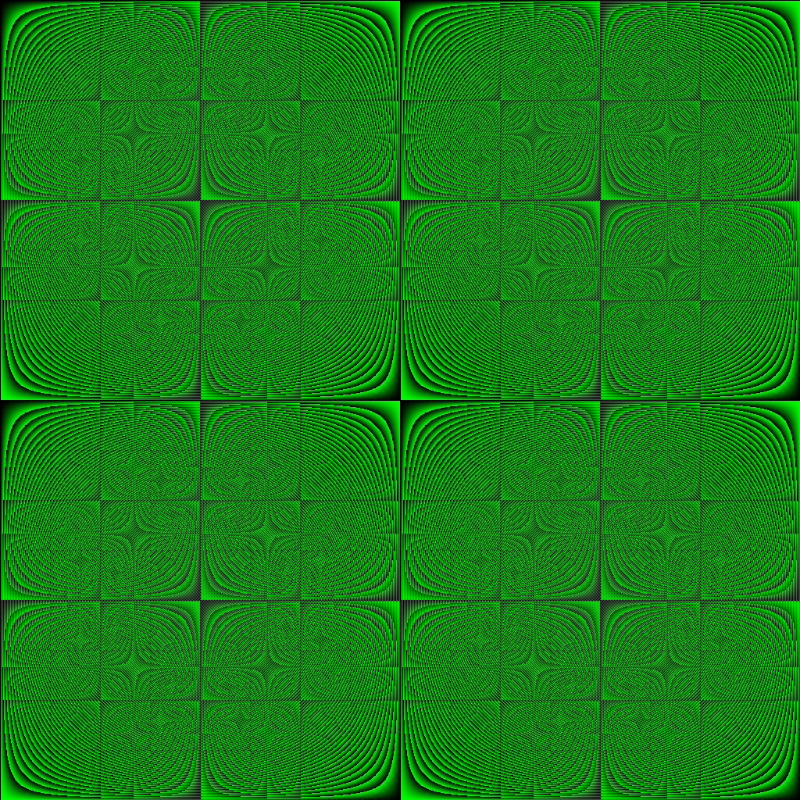

# Rings

Render residue class rings.  
Example output for `Z/2048Z`. Find out more about the topic at https://en.wikipedia.org/wiki/Modular_arithmetic.  
<h1 align="center">
    
</h1>

## Installation

```sh
# Dependencies
sudo apt-get install qt5-default

git clone https://github.com/ggwpez/rings
mkdir build && cd build
qmake ../rings && make
./rings 2048 1024
```

You should find the output in `Z-2048Z.1024x1024.png`.  
